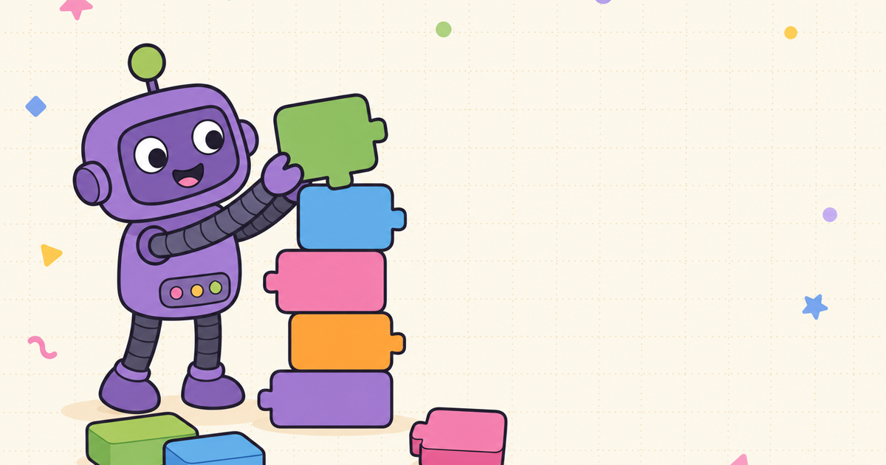

# ScratchML 🧠🧩

**Teach a computer to see — by snapping blocks together.**

### 👉 Play it now: **[scratchml.fly.dev](https://scratchml.fly.dev)** 👈

*No code. No math. No accounts. Nothing to install.*

---

## What is this?

ScratchML is a playground where kids, students, and the plain curious build a **real machine-learning model** the way they'd build with toy blocks:

1. 🧩 **Snap a recipe** — stack colorful blocks like Scratch: eyes, Things to learn, a brain, a guesser
2. 📸 **Show examples** — snap webcam pictures of each Thing… *or draw them on the sketchpad if you're camera-shy*
3. 🧠 **Train in seconds** — a tiny neural network studies your examples right in the browser
4. 🎉 **Watch it guess** — show it something new and see live confidence bars (confetti included)

The whole experience takes about two minutes from blank canvas to *"whoa, it learned!"* — and it's not a simulation. It's genuine transfer learning running on your own device.

## ✨ The fun parts

- 🎨 **Crayon sketchpad** — 7 crayons, 3 brush sizes, eraser, undo. Train a model on your doodles; no camera required
- 🤖 **A reactive robot mascot** that boots up, thinks while training, and celebrates correct guesses with you
- 🔊 **Toy-box sounds & music** — blocks snap, captures pop, training whooshes, wins go *ta-da* (toggleable, of course)
- 🗑 **Real dataset curation, kid-sized** — every captured example is a thumbnail you can inspect and delete one by one
- 📚 **It sneaks in real ML lessons**: more varied examples → smarter model; the model learns *whatever* separates your examples — including color!

## 🔒 Private by design

Your camera frames and drawings **never leave your browser**. There is no upload, no server-side ML, no account, no dataset sitting in a cloud bucket. Close the tab and it's gone.

## 🛠 Under the hood (for the curious)

- **MobileNet v2** (self-hosted weights) as a frozen feature extractor + a small trainable head — classic transfer learning, entirely client-side via **TensorFlow.js**
- Smart backend selection: machines with software-only WebGL automatically fall back to the CPU backend instead of stalling on shader compilation
- The brain pre-loads while you're still reading the landing page — by the time you click *Start building*, it's ready
- Built with Next.js, TypeScript, Tailwind, dnd-kit, and zustand; sound and art generated with ElevenLabs and OpenAI's image models
- Tested end-to-end with a Playwright suite that *actually draws shapes and verifies the model learns them*

## 🏆 Built for World Product Day

Created for **Mind the Product's "Everyone Ships Now"** hackathon — because the best way to celebrate shipping is to ship the thing that makes ML feel like play. **#EveryoneShipsNow** 🚢

---

**[▶ Teach a computer to see — right now](https://scratchml.fly.dev)**

